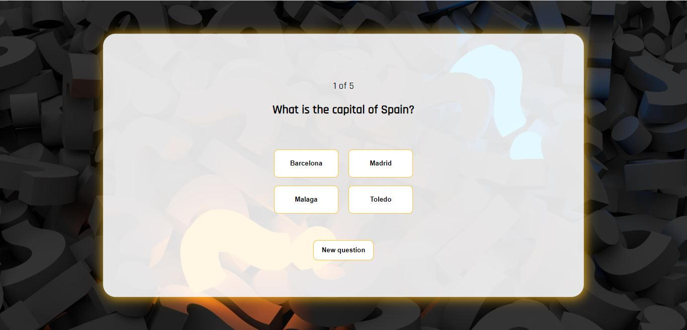
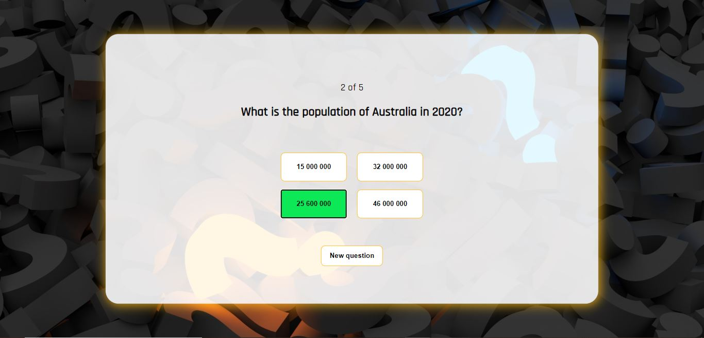
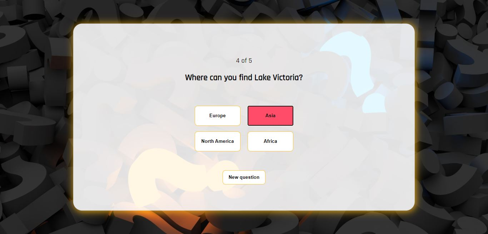
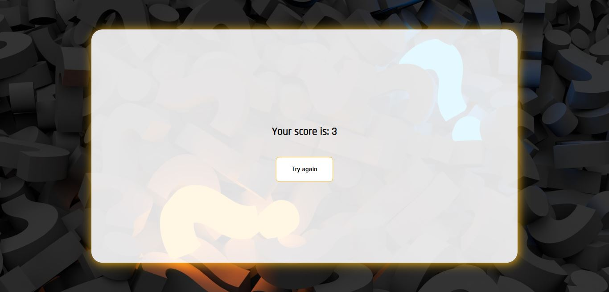

## Quiz project
In the application the user answers to different questions and at the end of the quiz they see their score. If the user chooses the correct answer the background color of the option turns green and if the user chooses a wrong answer it turns red.

You can visit the application [here](https://jennilehtonen.github.io/Quiz-project/).

|Table of contents|
|:------------- |
|1. [Technical solutions of the application](#Technical-solutions-of-the-application)|
|2. [Pictures of the user interface](#Pictures-of-the-user-interface)|

## Technical solutions of the application
Used technologies: **HTML, CSS and JavaScript**.

The questions, options and answers are stored into a separate JavaScript file.

I have taken those questions, options and answers from a separate JavaScript file and stored them to different arrays
and the program uses those arrays in order to show questions etc. When the user goes to the next question
the indexes of the arrays increase and the new question and the options show up on the screen. After the user
has choosed the option, the program checks if the right answer is chosen and then depending on the answer
the program either increases the score or not. At the end of the quiz the user sees their score and has the
ability to try again.

## Pictures of the user interface

This is the view when the user opens the quiz.

Here you can see that the application changes color depending on the answer. Here the user has chosen the correct answer so the background color of the option is green.

Here the user has chosen a wrong answer so the background color of the option is red.

Here is the "last" page of the application and here the user sees their score and they can try again the quiz if they want to.

