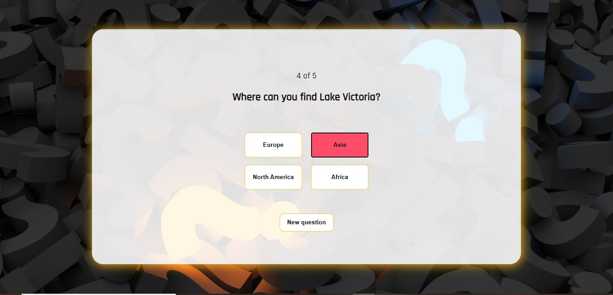

## Quiz project

Used technologies: **HTML, CSS and JavaScript**.

The questions, options and answers are stored into a separate JavaScript file.

I have taken those questions, options and answers from a separate JavaScript file and stored them to different loops
and the program uses those loops in order to show questions etc. When the user goes to the next question
the indexes of the loops increase and the new question and the options shows up on the screen. After the user
has choosed the option, the program checks if the right answer is chosen and then depending on the answer
the program either increases the score or not. At the end of the quiz the user sees their score and has the
ability to try again.

At the end of the documentation you can see pictures of the user interface.

This is the view when the user opens the quiz.

Here you can see that the application changes color depending on the answer. Here the user has chosen the correct answer so the background color of the option is green.

Here the user has chosen a wrong answer so the background color of the option is red.

Here is the "last" page of the application and here the user sees their score and they can try again the quiz if they want to.

